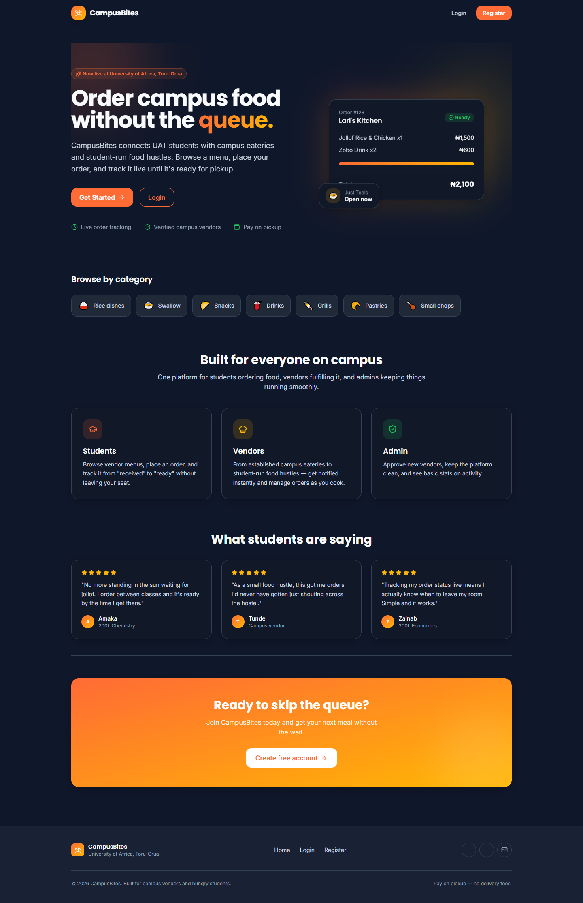
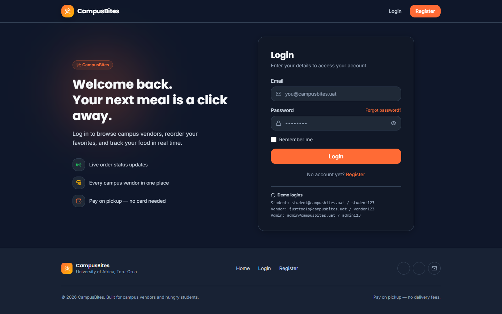
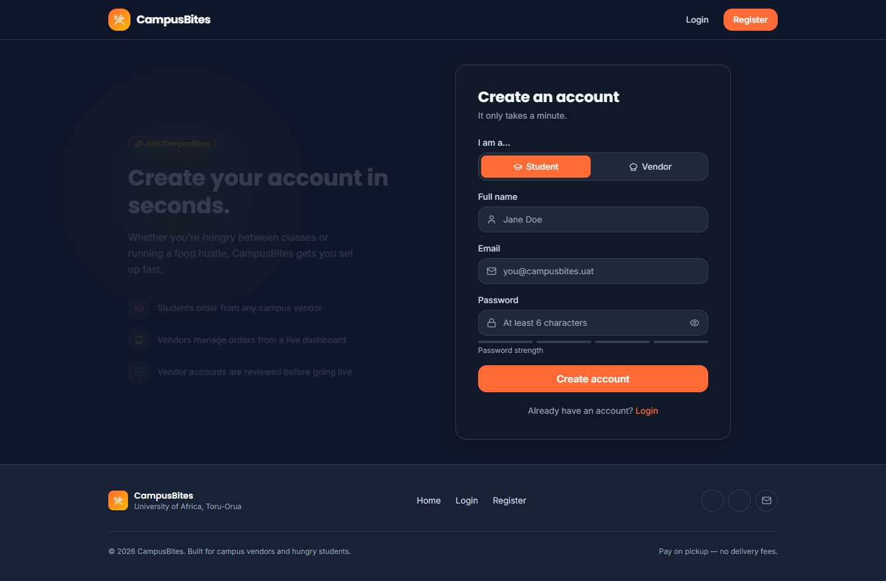
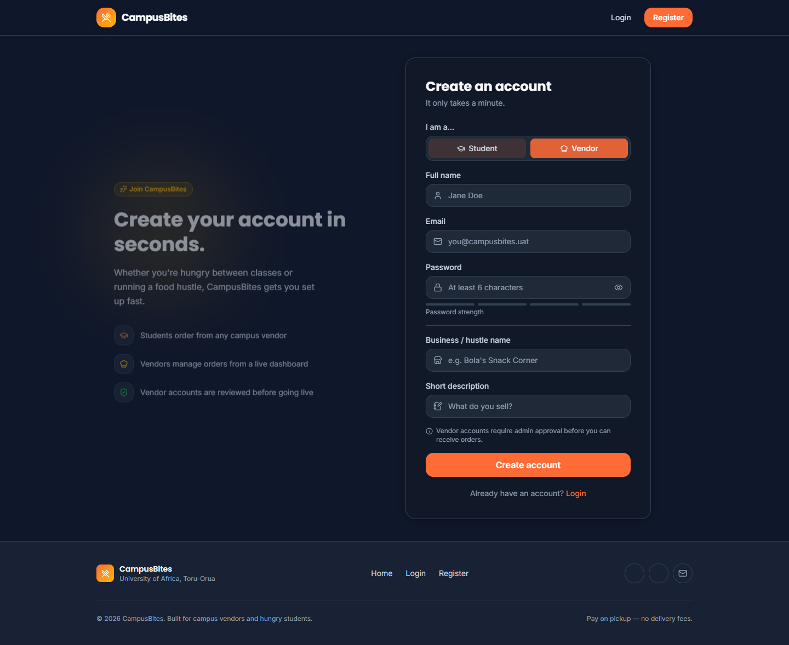
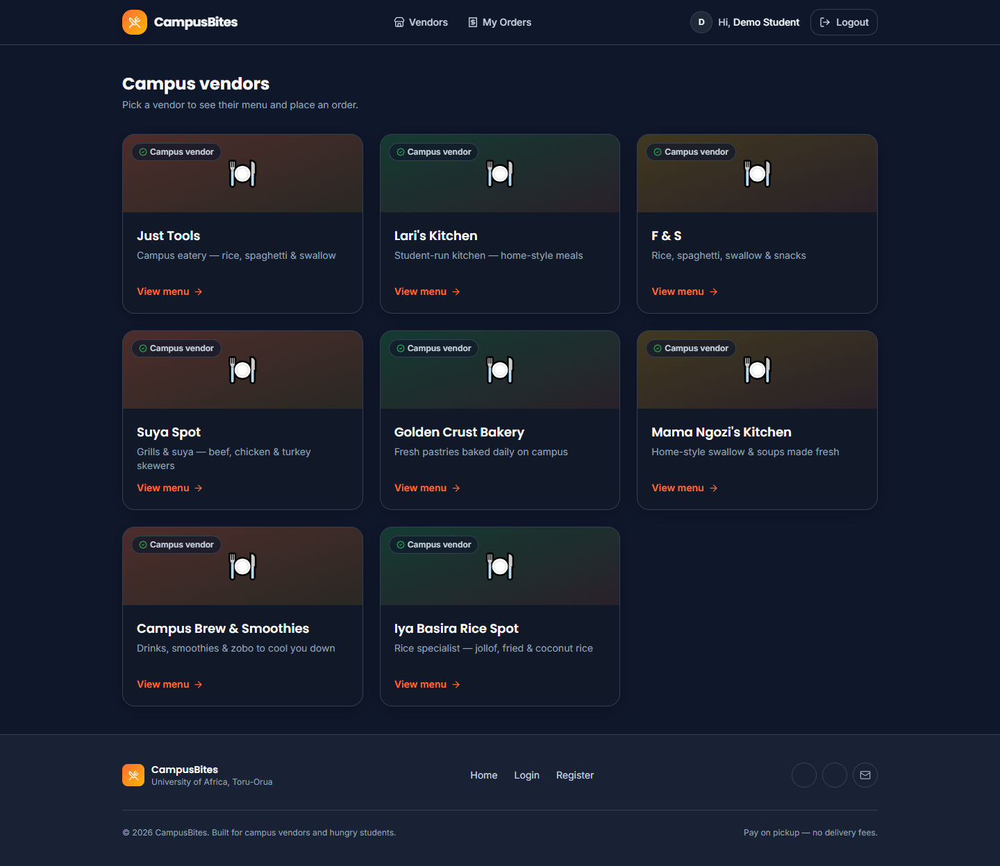
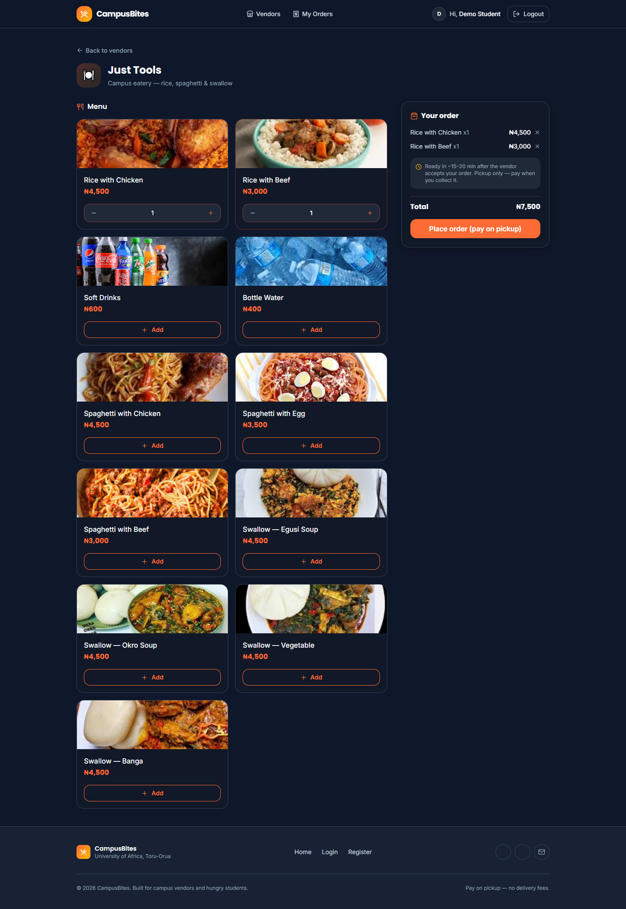
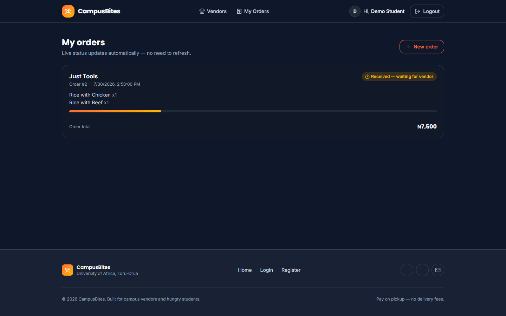
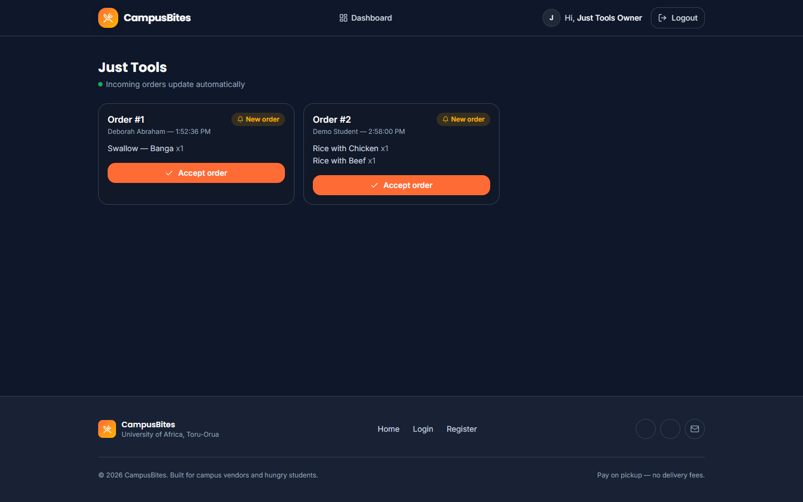
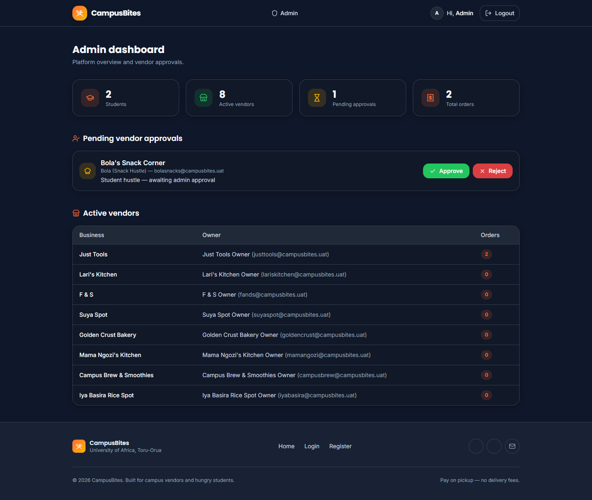

CHAPTER FOUR: SYSTEM IMPLEMENTATION, TESTING AND RESULTS
==========================================================

## 4.1 Introduction

Chapter Three described how CampusBites was analysed and designed. This chapter describes how that design was actually built, the environment and tools used to build it, the interface produced, how the finished system was tested, and what the testing showed. All figures, data values and outcomes reported in this chapter were taken directly from the running application rather than constructed for illustration; where a screenshot is shown, it is a screenshot of CampusBites as it runs on `localhost:3000`, and where a data value is quoted, it was read from the live `data/db.json` file at the time of writing.

## 4.2 Development Environment

CampusBites was developed and run on a Windows 10 Education machine (build 10.0.19045). The server-side runtime is Node.js (v24.18.0) with npm (v11.16.0) as the package manager. Development work was carried out from a terminal environment offering both Git Bash and PowerShell, and the application was exercised and visually verified in Google Chrome, the same browser used to produce the screenshots reproduced later in this chapter. No cloud hosting, container platform or CI pipeline was used at any stage; the project runs as a single local Node process listening on port 3000.

## 4.3 Programming Languages, Frameworks and Tools Used

**Table 4.1: Languages, frameworks and libraries used**

| Concern | Choice | Notes |
|---|---|---|
| Server-side language | JavaScript (Node.js) | Single language across the whole back end |
| Web framework | Express 4.19 | Routing, middleware, session handling |
| View templating | EJS 3.1 | Server-rendered HTML, partials for header/footer |
| Authentication | `express-session` + `bcryptjs` | Cookie session (8-hour expiry); passwords hashed, cost factor 8 |
| Styling | Tailwind CSS 3.4 | Compiled locally with the Tailwind CLI, **not** loaded from a public CDN |
| Client-side scripting | Vanilla JavaScript | Cart logic and polling; no front-end framework |
| Icon set | Lucide | Loaded via CDN `<script>` tag |
| Web fonts | Google Fonts (Inter, Poppins) | Loaded via CDN `<link>` tag |
| Persistence | Custom JSON file store (`data/store.js`) | No ORM, no external database engine |

One implementation decision is worth explaining in detail because it changed during the project rather than being right the first time. The interface was originally styled using Tailwind's "Play CDN" script (`cdn.tailwindcss.com`), which downloads and runs Tailwind's compiler in the browser at page-load time. When the running application was checked in an actual browser, every page rendered as unstyled, default-browser-font HTML — serif text, blue underlined links, no colours, no layout. The clearest evidence of the cause was that an element marked with Tailwind's `hidden` utility class (the vendor-only fields on the registration form) was still visibly showing, which is only possible if Tailwind's generated CSS was never applied at all. The CDN script was not loading in that browser environment. The fix was to stop depending on a script fetched at runtime: Tailwind was added as a development dependency, a `tailwind.config.js` and source stylesheet (`src/input.css`) were written locally, `npm run build:css` compiles them to a static file (`public/css/app.css`), and Express serves that file directly via `express.static`. The interface has depended on nothing but the local file system for its core visual styling since that change. This episode is reported in Section 4.8 as a concrete result of system testing, since it was testing — not code review — that surfaced it.

Two further tools were added purely to produce the documentation for this project and are not dependencies of the running application itself: `playwright-core`, used to drive a real, installed Chrome browser to capture the interface screenshots reproduced in Section 4.6, and Pandoc, used to convert this document to Word format.

## 4.4 Database Implementation

The database layer is implemented as a single JSON file, `data/db.json`, managed exclusively through `data/store.js`. That module exposes three functions: `load()`, which reads and parses the file (creating an empty, correctly-shaped file if none exists yet); `save(db)`, which serialises the in-memory object back to disk; and `tx(fn)`, a small synchronous "transaction" helper that loads the database, passes it to a callback that mutates it in place, saves the result, and returns whatever the callback returned. Every route handler that needs to read or write data goes through one of these three functions rather than touching the file directly, which keeps all persistence logic in one place.

Two scripts populate the database. `data/seed.js` performs a full reset — it clears every collection and rebuilds the admin account, every vendor in `data/vendor-catalog.js`, and a demo student account — and is intended for a brand-new installation. `data/add-new-vendors.js` does the opposite: it compares the vendor catalogue against the users already present (by e-mail) and inserts only the vendors that are missing, leaving every existing user, vendor, order and order item untouched. This second script exists because a real student account had already registered and placed a real order on the running instance by the time five additional vendors needed to be added to the catalogue; running the full reset script at that point would have destroyed that genuine data, so the non-destructive script was written instead and used in its place. A third utility, `data/list-images-needed.js`, reads whatever vendors and menu items currently exist and prints the exact photo filenames the interface will look for, so the list of images to source never has to be maintained by hand.

At the time of writing, the live database contains the record counts shown in Table 4.2, obtained by querying `data/db.json` directly.

**Table 4.2: Live data snapshot (data/db.json)**

| Collection | Count | Detail |
|---|---|---|
| users | 12 | 1 admin, 9 vendor-role accounts (8 active, 1 pending), 2 student accounts |
| vendors | 9 | 8 active (visible to students), 1 pending admin approval |
| menuItems | 68 | Across all 9 vendors |
| orders | 2 | Both placed against the vendor "Just Tools" during testing |
| orderItems | 2 | One line item per order at the time of writing |

## 4.5 System Implementation

**Registration and login.** `GET /register` renders a form with a role toggle (student or vendor); choosing "vendor" reveals two additional fields, business name and description, via a small client-side script rather than a page reload. On submission, `POST /register` validates the required fields, hashes the password with bcrypt, and creates the user record; a vendor account is created with `status: "pending"` and cannot log in until an administrator approves it, while a student account is created `active` and is logged in immediately. `POST /login` checks the supplied credentials with `bcrypt.compareSync`, rejects a still-pending vendor with an explicit message, and otherwise starts a session and redirects the user to the page appropriate to their role — `/vendors` for a student, `/vendor/dashboard` for a vendor, `/admin/dashboard` for an admin.

**Browsing and ordering.** `GET /vendors` lists only vendors whose owning account has `status: "active"`, so a pending or rejected vendor never appears to students. `GET /vendors/:id` renders that vendor's menu items with a client-side cart implemented entirely in the page's own `<script>` block: an in-memory `cart` object keyed by menu item ID accumulates quantities as items are added, a sticky order-summary panel re-renders on every change to show the running subtotal, and each menu item's "Add" button is replaced in place by a quantity stepper (minus / count / plus) once that item is in the cart, rather than staying a plain button. When the order is submitted, the cart is serialised to JSON into a hidden form field and posted to `POST /orders`, which looks up the vendor, creates the order record with `status: "pending"`, and creates one `orderItem` per line with `priceAtOrder` copied from the menu item's *current* price at that exact moment — so a later price change at the vendor never retroactively changes what an existing order is recorded as costing.

**Order tracking.** `GET /orders` renders a page that immediately calls `fetch('/api/orders/mine')` and repeats that call every four seconds, replacing the order list in place each time. Each order card shows a status badge and a proportional progress bar computed from where the order's status sits in the sequence `pending → preparing → ready → completed`. There is no WebSocket or server-push channel in this implementation; "live" updating is achieved by polling, which was an explicit, documented scope decision rather than an oversight.

**Vendor dashboard.** `GET /vendor/dashboard` and its companion `GET /api/vendor/orders` show a vendor only their own orders that are not yet completed, each with a single action button whose label and target status are computed server-side from a `NEXT_STATUS` map (`pending → preparing`, `preparing → ready`, `ready → completed`). A vendor cannot skip a step or set an arbitrary status because the only value the client can send is "advance to the next status," and what that next status is is decided by the server, not the request.

**Admin dashboard.** `GET /admin/dashboard` computes and displays platform counts (students, active vendors, pending vendors, total orders) directly from the live data on every request rather than from a cached figure, lists every pending vendor with Approve/Reject actions, and lists every active vendor with its owner and a live count of orders placed against it. Approving a vendor simply flips their account `status` to `active`; rejecting one flips it to `rejected` **and** deletes that vendor's business record and every one of their menu items, since a rejected vendor should not leave orphaned menu data behind.

**Vendor and menu photography.** Vendor and menu-item images are not stored as a database field. Instead, a vendor's business name or a menu item's name is passed through a `slugify()` helper (exposed to every view via `app.locals.slugify` in `server.js`) to produce a predictable filename — for example, "Swallow — Egusi Soup" becomes `swallow-egusi-soup` — and the page requests `/images/menu/swallow-egusi-soup.jpg`. Because the filename is derived from the dish name rather than from a per-vendor record, several vendors selling the same dish (for instance, four different vendors all sell "Rice with Chicken") automatically share one photograph instead of requiring a duplicate upload each. If that file does not exist, a small client-side helper (`imgFallback`, defined once in the page `<head>` so it exists before any image on the page can trigger it) retries the same base name with `.jpeg`, `.png`, then `.webp` in turn, and if none of the four exist, removes the broken `` element entirely, revealing an icon placeholder that was sitting behind it the whole time. This means a vendor or dish with no photo yet degrades to a clean placeholder rather than a broken-image icon.

## 4.6 User Interface Design

The interface uses a single dark colour palette defined once, in `tailwind.config.js`, and referenced by name everywhere else rather than by literal colour values: an orange primary (`#FF6B35`) for calls to action, an amber accent (`#FFB703`), semantic green/red for success and danger states, and a small set of near-black background and grey text tones. Typography uses two Google Fonts — Poppins for headings, Inter for body text — and every reusable interface element (buttons, form fields, cards, badges) is defined once as a named component class in `src/input.css` (`.btn-primary`, `.btn-secondary`, `.input-field`, `.card`, `.badge`, and so on) rather than being restyled individually on each page, so a button looks and behaves identically whether it appears on the login page or the admin dashboard. The navigation bar is sticky, collapses to a hamburger menu below the tablet breakpoint, and adapts its links to the signed-in user's role.

The following figures were captured directly from the running application using an automated Chrome session, exactly as a real visitor would see the page — no image has been edited or mocked up.

*Figure 4.1* shows the landing page, presented to a visitor who is not signed in.

*Figure 4.2* shows the login page, including the demo-account credentials panel used during development and testing.

*Figure 4.3* shows the registration page in its default state (Student role selected).

*Figure 4.4* shows the same registration page immediately after the Vendor option is chosen, revealing the business-name and description fields described in Section 4.5.

*Figure 4.5* shows `GET /vendors` signed in as the demo student account, listing all eight currently active vendors described in Table 4.2.

*Figure 4.6* shows the "Just Tools" vendor menu with "Rice with Chicken" and "Rice with Beef" added to the cart, the quantity steppers that replaced their "Add" buttons, and the order-summary panel with a running total of ₦7,500.

*Figure 4.7* shows the order placed in Figure 4.6 (Order #2) on the student's order-tracking page, with its "Received — waiting for vendor" status badge and progress bar.

*Figure 4.8* shows the "Just Tools" vendor dashboard with both real orders currently in the system — Order #1 and Order #2 — each awaiting the vendor's "Accept order" action.

*Figure 4.9* shows the administrator dashboard with the live platform counts from Table 4.2, the one pending vendor ("Bola's Snack Corner") awaiting approval, and the full active-vendor table.

## 4.7 System Testing

### 4.7.1 Unit Testing

No automated unit test suite was implemented for this project — `package.json` defines no `test` script, and no unit-testing framework (such as Jest or Mocha) is present among its dependencies. This is stated plainly rather than invented: individual functions such as `slugify()` and the `tx()` persistence helper were exercised only indirectly, through manual and system-level testing, not through isolated automated unit tests.

### 4.7.2 Integration Testing

Integration between the routing layer, the session/authentication middleware and the JSON data store was verified manually, using scripted HTTP requests (`curl`) that carried a real session cookie through a sequence of calls rather than testing any one route in isolation. For example, one verification sequence registered a vendor account, confirmed that logging in with it was rejected with a "pending approval" message, approved that account from the admin flow, and then confirmed the same credentials could log in and reach the vendor dashboard — exercising the auth middleware, three separate routers, and the data store together in one pass. The automated browser session used to capture Section 4.6's screenshots is itself a second, independent integration check: it logs in as three different roles in turn and drives each one through a real multi-page flow (browse → add to cart → place order → track status; view incoming orders; view admin stats), rather than loading pages in isolation. No automated integration-testing framework was used; both of the checks above were scripted and run manually.

### 4.7.3 System Testing

The complete system was exercised end-to-end for all three roles. This included: requesting every page while logged out, while logged in as a student, while logged in as a vendor, and while logged in as an admin, and confirming each returned the expected HTTP status code rather than an error page; inspecting the rendered HTML of every page for leftover template syntax or server-side errors; confirming that appending five new vendors via `data/add-new-vendors.js` left the pre-existing user account and its order completely untouched (verified by re-reading `data/db.json` before and after and diffing the user and order counts); and confirming the image fallback mechanism in both directions — that a present photo (for example `rice-with-chicken.jpg`) resolves and displays, and that an absent one (every vendor photo, none of which had been supplied as of this writing) falls back to the placeholder icon rather than a broken image. No formal user-acceptance testing with independent test users outside the development of this project was carried out, and that is reported here rather than presented as having taken place.

**Table 4.3: Summary of testing performed**

| Testing type | Performed? | Method |
|---|---|---|
| Unit testing | No | Not implemented — no test framework in the project |
| Integration testing | Yes (manual) | Scripted `curl` sessions across routers; automated multi-role browser session |
| System testing | Yes (manual) | Full-application walkthrough for all three roles; data-integrity check before/after a live data change |
| User acceptance testing | No | No independent test users were involved |

## 4.8 Results and Discussion

The system functions end to end: as Table 4.2 and Figures 4.6–4.8 show, two real orders exist in the live database, both placed against the vendor "Just Tools." Order #1 was placed by a genuinely registered student account (Deborah Abraham) for one "Swallow — Banga" at ₦4,500; Order #2 was placed during testing for one "Rice with Chicken" and one "Rice with Beef," totalling ₦7,500. Both orders appear correctly on the student order-tracking page with a "pending" status and on the vendor dashboard as orders awaiting acceptance, which confirms that the order-placement, price-snapshot and status-polling mechanisms described in Section 4.5 work together correctly on real, not synthetic, data.

The most significant finding from testing was not a feature bug but an environment one: as detailed in Section 4.3, the original CDN-based styling approach produced a completely unstyled interface in the actual browser used for testing, even though the same markup rendered correctly whenever the CDN happened to be reachable. This was only caught because the interface was actually opened in a browser and inspected, rather than assumed correct from the code; a specific, checkable symptom — a `hidden` element still being visible — made the root cause identifiable rather than a guess. Switching to a locally compiled stylesheet removed the dependency and was re-verified afterwards by confirming, via direct HTTP request, that `/css/app.css` was served with a `text/css` content type and contained the expected compiled class rules.

Image handling was tested against real files supplied for this project. All 33 required menu-item photographs (one per distinct dish name across all vendors) were supplied and, once two filenames that did not match the expected slug were corrected, all resolve correctly on the vendor menu page, as shown in Figure 4.6. None of the nine vendor photographs had been supplied as of this writing, so vendor cards across the application currently display their icon placeholder rather than a photograph; this is reported as the current, honest state of that feature rather than as complete, since the fallback mechanism working correctly is a distinct result from the photographs themselves being present.

No performance benchmarking, concurrent-load testing, or user-satisfaction survey was carried out during this project, and so no response-time figures, throughput numbers, or satisfaction percentages are reported. Reporting such figures without having measured them would misrepresent the testing that was actually done, and Section 4.7 already states plainly which forms of testing were and were not performed.
