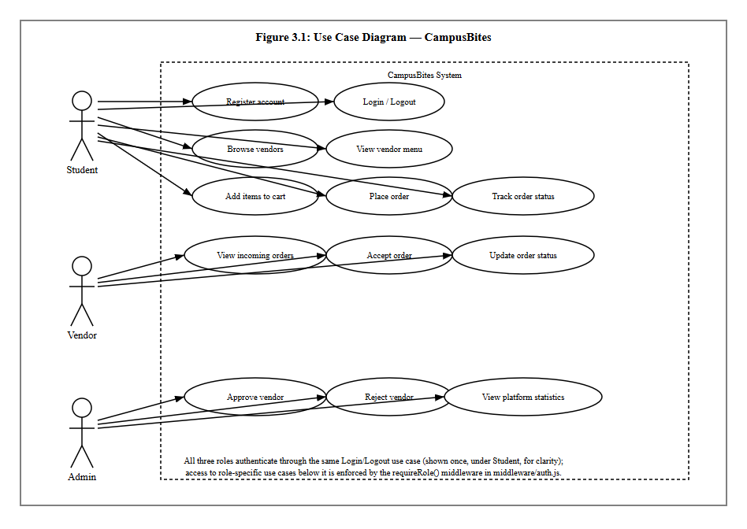
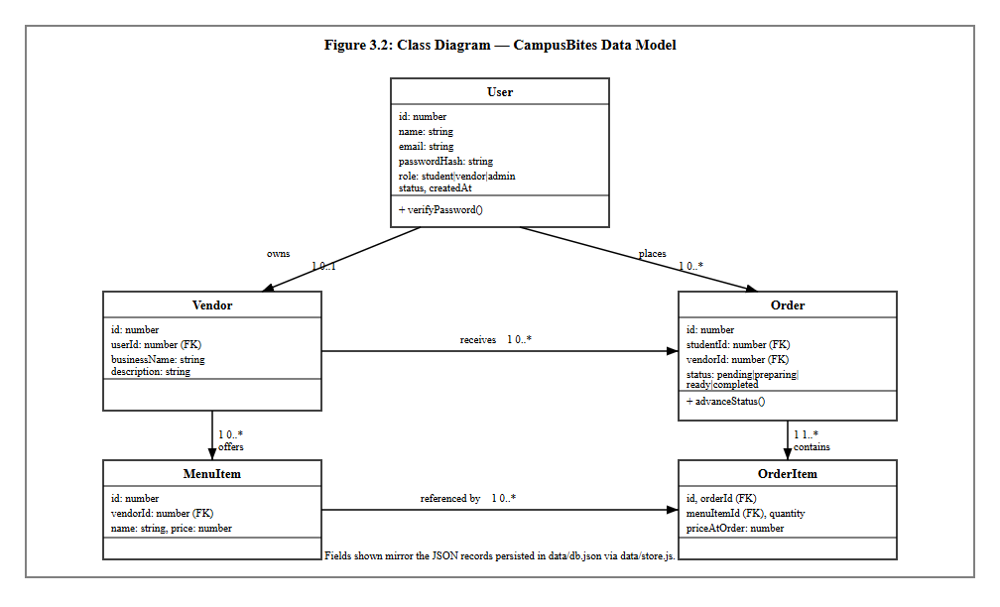
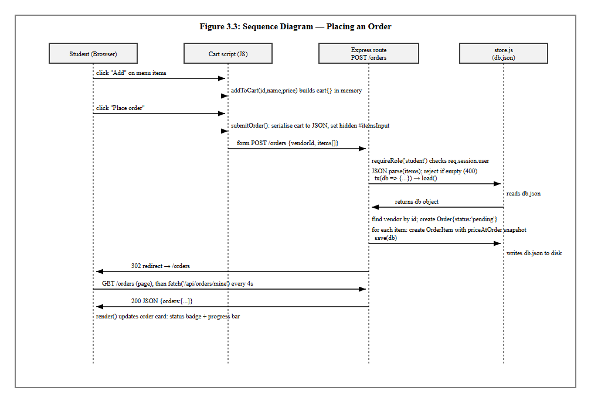
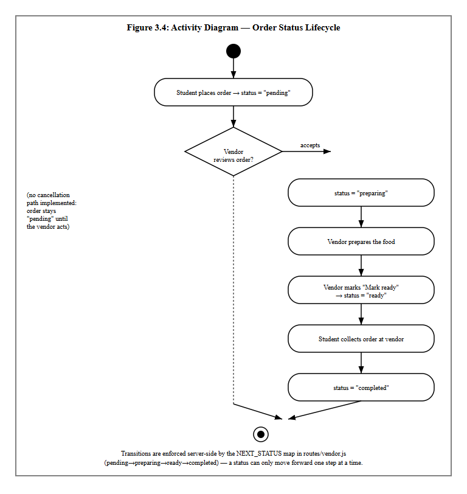
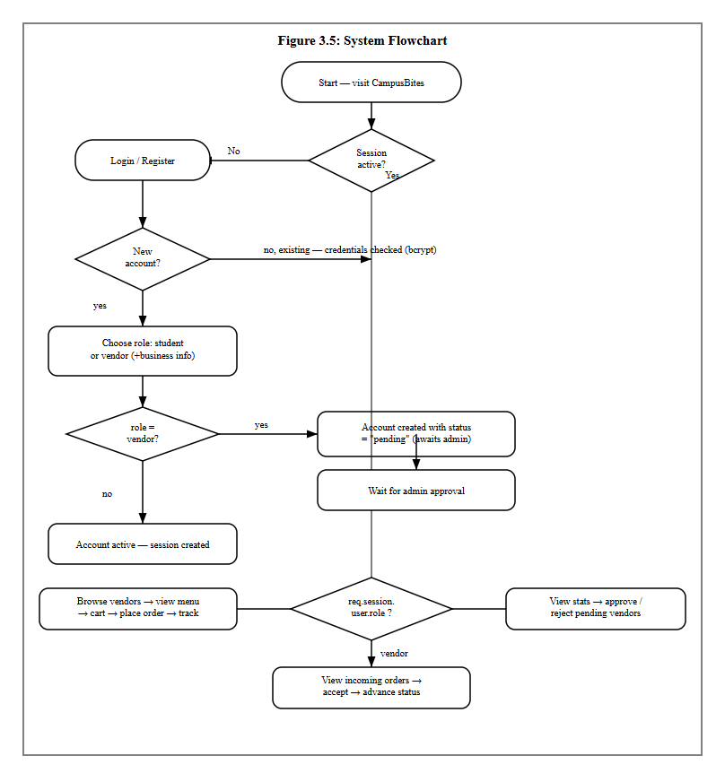

CHAPTER THREE: SYSTEM ANALYSIS AND DESIGN METHODOLOGY
=======================================================

## 3.1 Introduction

This chapter presents the analysis and design work that produced CampusBites, the online food ordering system built for this project. CampusBites is a role-based web application that allows students at University of Africa, Toru-Orua (UAT) to order food from campus vendors without having to queue physically at an eatery, allows vendors to receive and manage those orders from a dashboard, and allows an administrator to control which vendors are allowed to trade on the platform. The chapter covers how the existing (manual) way of getting food on campus was analysed, the problems that analysis surfaced, the methodology adopted to build a replacement, the functional and non-functional requirements derived from that analysis, and the design artefacts — architecture, database design and UML diagrams — that guided the implementation described in Chapter Four.

Everything described in this chapter reflects the system as it was actually built. Where the implementation departs from what might be expected of a typical academic food-ordering system — for instance, the choice of a JSON document store instead of a relational database, or the decision to poll for order updates instead of using WebSockets — the reasoning behind that decision is stated explicitly rather than glossed over.

## 3.2 Analysis of Existing System

Before CampusBites, food ordering at UAT's campus eateries followed the pattern common to most Nigerian tertiary institutions: a student walks to a vendor's stall or shop, joins whatever queue is there, states their order verbally, waits while it is prepared (or while orders ahead of theirs are prepared), and pays on collection. Some vendors keep a rough mental or paper record of pending orders during busy periods; none of the vendors observed during this project used any digital system to record, sequence, or track orders.

This arrangement works, in the sense that food gets served, but it has no mechanism for a student to know how long a wait will be, no way for a vendor to smooth out a rush of simultaneous orders, and no institutional oversight of who is operating as a food vendor on campus. Vendors range from established eateries to informal student-run "food hustles" operating out of a room or a table, and there is no shared, campus-wide way for a new vendor to be discovered by students or for the school to keep a record of who is currently trading.

## 3.3 Problems Identified in the Existing System

Analysis of the existing (manual) process identified the following recurring problems:

1. **Physical queueing.** Students must be physically present at a vendor to place and wait for an order, which is wasteful of time between lectures.
2. **No order status visibility.** Once an order is placed verbally, the student has no way of checking its progress except by waiting at the counter or asking again.
3. **Order mix-ups during rush periods.** Verbal ordering with no written or digital record makes it easy for a vendor serving several customers at once to lose track of who ordered what.
4. **No discovery mechanism for smaller vendors.** Student-run food hustles rely entirely on word of mouth; there is no shared listing a new student can browse to see what is available on campus.
5. **No vetting of who can sell food on campus.** Anyone can claim to be selling food with no institutional record of active, approved vendors.
6. **No historical record for the student.** There is no order history a student can refer back to — for a repeat order, a receipt, or a record of what was actually paid for a given item on a given day.

## 3.4 Justification for the New System

CampusBites was built specifically to address the problems listed in Section 3.3, rather than to replicate the feature set of a general-purpose commercial food delivery app. Because the existing process is pickup-based rather than delivery-based, the system was scoped around **ordering ahead and tracking status**, not around delivery logistics, live rider tracking, or payment processing — none of which the existing campus process has or needs at this stage.

Concretely, the new system addresses each problem as follows: students can browse a vendor's menu and place an order from anywhere with a browser, removing the need to queue before ordering (Problem 1); the order-tracking page polls the server every four seconds so a student can see their order move from "received" to "preparing" to "ready" without needing to ask anyone (Problem 2); every order is recorded as a structured record with itemised quantities and a price snapshot at the time of ordering, removing the ambiguity of a verbal order (Problem 3); every vendor, from an established eatery to a one-person snack hustle, gets the same listing page a student can browse (Problem 4); a vendor account is not usable until an administrator has approved it, giving the school a single point of control over who can trade (Problem 5); and a student's past orders remain visible on an order history page (Problem 6).

## 3.5 Methodology Adopted

The system was built iteratively rather than to a single upfront design. Development began by deliberately narrowing scope to the core order flow — registration, login, browsing, ordering, and status tracking — before any visual design work was attempted, so that a working, clickable system existed early. Later iterations layered additional work on top of that working core: a full visual redesign of every page around a single dark colour theme and a consistent component system, followed by the addition of real vendor and menu photography, and the addition of five further vendors to the seed data. Each iteration was tested against the running application before the next one began, rather than all requirements being designed in full up front and implemented in one pass.

This incremental approach was chosen over a strict Waterfall model because the requirements for a project like this are refined by seeing the system run — for example, the decision to compile Tailwind CSS locally rather than load it from a public CDN (discussed in Section 4.3) was made only after the CDN-based approach was seen to fail in the actual deployment environment, something that would not have surfaced from design documents alone. It is also worth recording candidly that the project's original specification document anticipated SQLite (via `better-sqlite3`) as the persistence layer; the system as actually implemented instead uses a JSON document file (`data/db.json`) managed through a small custom module (`data/store.js`). This is exactly the kind of adjustment an iterative approach is meant to absorb: the simpler flat-file store was sufficient for the scope actually being built and removed a native-module dependency, so the plan was revised rather than followed rigidly.

## 3.6 Requirements Analysis

### 3.6.1 Functional Requirements

The functional requirements below were derived directly from the three user roles the system supports — student, vendor and administrator — and correspond one-to-one with routes implemented in `routes/auth.js`, `routes/student.js`, `routes/vendor.js` and `routes/admin.js`.

**Table 3.1: Functional Requirements**

| No. | Requirement | Implemented by |
|---|---|---|
| FR1 | A visitor shall be able to register as either a student or a vendor, supplying role-specific fields (business name and description for vendors). | `POST /register` |
| FR2 | A registered user shall be able to log in with an email and password, and log out. | `POST /login`, `POST /logout` |
| FR3 | A newly registered vendor account shall remain inactive ("pending") until an administrator approves it. | `status` field on `users`; enforced at login in `routes/auth.js` |
| FR4 | A logged-in student shall be able to browse a list of active (approved) vendors. | `GET /vendors` |
| FR5 | A student shall be able to view a specific vendor's menu with item names and prices. | `GET /vendors/:id` |
| FR6 | A student shall be able to build a cart of menu items and quantities before ordering. | Client-side cart logic in `views/vendor-menu.ejs` |
| FR7 | A student shall be able to submit the cart as an order, which is recorded with an itemised price snapshot. | `POST /orders` |
| FR8 | A student shall be able to view their own order history with a live-updating status. | `GET /orders`, `GET /api/orders/mine` |
| FR9 | A vendor shall be able to view their own incoming, unfulfilled orders. | `GET /vendor/dashboard`, `GET /api/vendor/orders` |
| FR10 | A vendor shall be able to advance an order through its status lifecycle one step at a time. | `POST /vendor/orders/:id/advance` |
| FR11 | An administrator shall be able to view platform-wide counts (students, active vendors, pending vendors, total orders). | `GET /admin/dashboard` |
| FR12 | An administrator shall be able to approve or reject a pending vendor account. | `POST /admin/vendors/:userId/approve`, `POST /admin/vendors/:userId/reject` |
| FR13 | Rejecting a vendor shall remove that vendor's business record and menu items along with it. | `routes/admin.js` reject handler |

### 3.6.2 Non-Functional Requirements

**Table 3.2: Non-Functional Requirements**

| No. | Requirement | How it is addressed |
|---|---|---|
| NFR1 | Usability | A single, consistent dark-themed design system (colour palette, spacing, typography, reusable component classes) is applied across every page so the interface behaves predictably regardless of which role is using it. |
| NFR2 | Responsiveness | Layouts use a mobile-first grid (Tailwind CSS breakpoints) so pages remain usable on phone, tablet and desktop widths. |
| NFR3 | Security | Passwords are hashed with bcrypt before storage; no plaintext password is ever persisted. Role-based access is enforced server-side by the `requireRole()` middleware, not merely hidden in the interface. |
| NFR4 | Data integrity | The price of each order item is copied into the order record (`priceAtOrder`) at the moment of ordering, so a later change to a menu item's price cannot alter the amount owed on an existing order. |
| NFR5 | Availability of core styling | The visual design does not depend on a third-party CDN being reachable at runtime; Tailwind CSS is compiled to a local file served by the application itself (see Section 4.3). |
| NFR6 | Maintainability | Vendor and menu seed data is defined once in `data/vendor-catalog.js` and consumed by both the full reseed script and the incremental "add vendors" script, so the two never drift out of sync. |
| NFR7 | Graceful degradation | A missing vendor or menu photo does not break a page; the interface falls back to an icon placeholder instead of showing a broken image. |

## 3.7 System Design

CampusBites follows a layered, server-rendered architecture rather than a single-page-application design, in keeping with its scope as a project built by one developer without a separate front-end build pipeline. The layers are:

- **Presentation layer** — EJS templates in `views/`, split into page templates and two shared partials (`views/partials/header.ejs`, `views/partials/footer.ejs`) that every page includes, so the navigation bar, footer, fonts, icon library and compiled stylesheet only need to be defined once.
- **Routing / controller layer** — four Express routers (`routes/auth.js`, `routes/student.js`, `routes/vendor.js`, `routes/admin.js`), each scoped to one area of the system and mounted on the main `server.js` application.
- **Middleware layer** — `middleware/auth.js` exposes `attachUser` (reads the session and exposes the current user to every view) and `requireRole` (blocks a request unless the session's user has one of the allowed roles).
- **Data / persistence layer** — `data/store.js` exposes `load()`, `save()` and a `tx()` helper that loads the JSON file, lets a callback mutate it, and writes it back, giving the rest of the application a single, synchronous place where all reads and writes happen.
- **Client-side behaviour** — small, page-scoped `<script>` blocks (no front-end framework) handle the cart on the vendor menu page and the four-second polling used on the order-tracking and vendor dashboard pages.

The request/response cycle is conventional Express: a request enters through session and body-parsing middleware, is attached the current user, is routed to the matching handler, and that handler either renders an EJS view or returns JSON (for the two polling endpoints, `/api/orders/mine` and `/api/vendor/orders`). Static assets — the compiled stylesheet and vendor/menu photos — are served directly from the `public/` directory by Express's built-in static file middleware.

## 3.8 Database Design

The system's data is persisted as a single JSON document (`data/db.json`) containing five collections — `users`, `vendors`, `menuItems`, `orders` and `orderItems` — plus a `counters` object used to generate sequential integer IDs. Although the storage mechanism is a flat file rather than a relational database engine, the five collections are still designed relationally: each record carries foreign-key-style references to the record it belongs to, and the relationships between them are exactly what would be expressed as foreign keys in a SQL schema.

**Table 3.3: users**

| Field | Type | Description |
|---|---|---|
| id | integer | Primary key |
| name | string | Full name |
| email | string | Login identifier, must be unique |
| passwordHash | string | bcrypt hash of the password (cost factor 8) |
| role | enum | `student` \| `vendor` \| `admin` |
| status | enum | `active` \| `pending` \| `rejected` (vendors only meaningfully use `pending`/`rejected`) |
| createdAt | ISO datetime | Account creation timestamp |

**Table 3.4: vendors**

| Field | Type | Description |
|---|---|---|
| id | integer | Primary key |
| userId | integer | Foreign key → `users.id` (the account that owns this vendor profile) |
| businessName | string | Public-facing business name |
| description | string | Short description shown on the vendor listing and menu page |

**Table 3.5: menuItems**

| Field | Type | Description |
|---|---|---|
| id | integer | Primary key |
| vendorId | integer | Foreign key → `vendors.id` |
| name | string | Dish or product name |
| price | number | Price in naira |

**Table 3.6: orders**

| Field | Type | Description |
|---|---|---|
| id | integer | Primary key |
| studentId | integer | Foreign key → `users.id` (the student who placed the order) |
| vendorId | integer | Foreign key → `vendors.id` |
| status | enum | `pending` → `preparing` → `ready` → `completed` |
| createdAt | ISO datetime | Order placement timestamp |

**Table 3.7: orderItems**

| Field | Type | Description |
|---|---|---|
| id | integer | Primary key |
| orderId | integer | Foreign key → `orders.id` |
| menuItemId | integer | Foreign key → `menuItems.id` |
| quantity | integer | Quantity ordered |
| priceAtOrder | number | Snapshot of the menu item's price at the moment the order was placed |

The relationships between these six tables are shown as a class diagram in Figure 3.2 (Section 3.9.2): a user owns at most one vendor profile; a user (as a student) places many orders; a vendor offers many menu items and receives many orders; and an order contains many order items, each of which references the menu item it was ordered from.

## 3.9 Unified Modeling Language (UML) Diagrams

### 3.9.1 Use Case Diagram

Figure 3.1 shows the use cases available to each of the three actors. Login/Logout is shown once, under Student, to avoid repeating an identical use case three times; all three roles authenticate through the same mechanism, and which further use cases a logged-in session can reach is decided by the `requireRole()` middleware rather than by the interface.

### 3.9.2 Class Diagram

Figure 3.2 models the five persisted entities described in Section 3.8 as classes, with the multiplicities of the relationship between each pair.

### 3.9.3 Sequence Diagram

Figure 3.3 traces a single, representative interaction — a student placing an order — across the four collaborating parts of the system: the browser, the client-side cart script, the Express route handling `POST /orders`, and the `store.js` persistence module. It reflects the actual control flow in `routes/student.js`, including the price-snapshot step and the subsequent polling that populates the order-tracking page.

### 3.9.4 Activity Diagram

Figure 3.4 models the order status lifecycle itself, from the moment a student places an order to the moment it is marked completed. The dotted branch is included deliberately to record a real, current limitation: there is no cancellation activity implemented, so an order left unattended by a vendor simply remains in the "pending" state indefinitely.

## 3.10 System Flowchart

Figure 3.5 gives an overall, role-agnostic view of how a single visit to the system is handled, from the initial session check through to the point where the flow branches into the student, vendor and administrator paths described individually in Figures 3.1–3.4.

